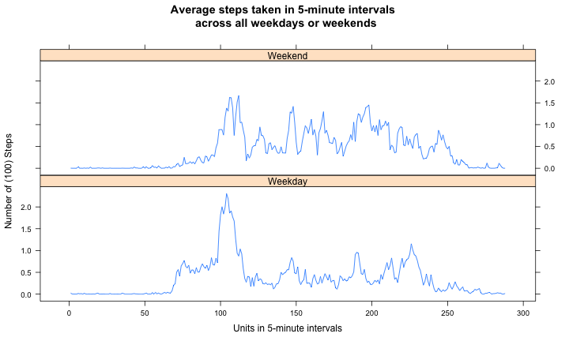

## Loading and preprocessing the data


```r
library(plyr)
#
##  Fork/clone the GitHub repository created for this assignment
#   Unzip/read the activity file, and transform the intervals into 1:288 range
#
if (!file.exists("activity.csv")) {
        unzip("activity.zip")}

if(!exists("activity")) {
        activity <- tbl_df(read.csv("activity.csv", stringsAsFactors = FALSE))}

activity <- mutate(activity, intlevel = unclass(factor(activity$interval)))
```
  
  
## What is mean/median total number of steps taken per day?  


```r
# The missing values in the dataset are ignored, for now.
#  1. Make a histogram of the total number of steps taken each day
#  2. Calculate and report the mean and median total number of steps taken per
#
d <- ddply(subset(activity, (!is.na(steps))), .(date), summarize, stepsum=sum(steps))

dMean <- mean(d$stepsum)
dMedian <- median(d$stepsum)
cat(" 1.  The mean total number of steps taken per day: ", dMean, "steps.", "\n",
    "2.  The median total number of steps taken per day: ", dMedian, "steps.")

hist(d$stepsum/1000, ylim = c(0,30),xlab = "Total number of (1,000) steps per day", 
     main = paste("Histogram of total steps taken each day", "\n", 
                  "(missing values are ignored)"))
```

 

```
##  1.  The mean total number of steps taken per day:  10766.19 steps. 
##  2.  The median total number of steps taken per day:  10765 steps.
```

## What is the average daily activity pattern?


```r
#  1. Make a time series plot (i.e. type = "l") of the 5-minute interval (x-axis)
#     and the average number of steps taken across all days (y-axis)
#  2. Find out which 5-minute interval, on average across all the days in the
#     dataset, contains the maximum number of steps.
#
dtx <- ddply(subset(activity, (!is.na(steps))), .(intlevel), summarize, stepmean=mean(steps))

maxrow <- subset(dtx, dtx$stepmean == max(dtx$stepmean))
maxinterval <- unique(subset(activity, activity$intlevel==maxrow$intlevel)$interval)

cat("The ", maxrow$intlevel, "th 5-minute interval ", "(or ", maxinterval, ")",
    " contains the maximum average number of ", maxrow$stepmean, " steps.", sep="")

with(dtx, plot(intlevel, stepmean, type = "l", 
               xlab = "Units in 5-minute intervals", ylab = "Average steps", 
               main = paste("Average steps taken in 5-minute intervals", "\n",
                            "across all days, Oct.1 - Nov.30, 2012")))
```

 

```
## The 104th 5-minute interval (or 835) contains the maximum average number of 206.1698 steps.
```

```
##  Activities begin around 70th interval (545) and peek up at 104th interval (835). 
##  There are moderate activities throughout the day until 235th interval (1930); 
##   and then activities die down after the 260th interval (2135).
```
## Imputing missing values


```r
# Create a new dataset that is equal to the original dataset but with the   
# missing data filled in with the above calculated average number of steps of 
# the specific interval
#
actNa <- select(mutate(join(subset(activity, (is.na(steps))), dtx), 
                       steps = stepmean), -stepmean)

activityNew <- arrange(rbind(actNa, subset(activity, (!is.na(steps)))), 
                       date, interval)

dNew <- ddply(activityNew, .(date), summarize, stepsumNew=sum(steps))
dnewMean <- mean(dNew$stepsumNew)
dnewMedian <- median(dNew$stepsumNew)

cat(" Total number of missing values (NAs) in the dataset: ", nrow(actNa), "\n",
"The NAs are filled with the average number of steps of the specific interval.", "\n",
"The mean total number of steps taken per day: ", dnewMean, "steps.", "\n",
"The median total number of steps taken per day: ", dnewMedian, "steps.", "\n",
"The mean/median values (", dnewMean, "/", dnewMedian, ") do not differ much from", "\n", 
" that of the dataset with missing values (", dMean, "/", dMedian, ").", "\n",
"The new dataset is symmetrically distributed, but the missing values", "\n",
" dataset is a bit of left skewed.")

hist(dNew$stepsumNew/1000, ylim = c(0,40), xlab = "Total number of (1,000) steps per day", 
     main = paste("Histogram of total steps taken each day", "\n", 
                  "( missing values filled with the average  ", "\n", 
                  "number of steps of the interval )"))
```

 

```
##  Total number of missing values (NAs) in the dataset:  2304 
##  The NAs are filled with the average number of steps of the specific interval. 
##  The mean total number of steps taken per day:  10766.19 steps. 
##  The median total number of steps taken per day:  10766.19 steps. 
##  The mean/median values ( 10766.19 / 10766.19 ) do not differ much from 
##   that of the dataset with missing values ( 10766.19 / 10765 ). 
##  The new dataset is symmetrically distributed, but the missing values 
##   dataset is a bit of left skewed.
```


```
##  The noticeable impact of imputing the missing values appears only to increase the frequency 
##   of the total daily number of steps, ranging from 10,000 to 15,000.
```
## Are there differences in activity patterns between weekdays and weekends?


```r
# Use the dataset with the filled-in missing values from above
# Add a new factor variable, weekday, indicating whether a date 
# is weekday or weekend.
# Make a time series plot of the 5-minute interval (x-axis) and the average
# number of steps taken across all weekday days or weekend days (y-axis). 
#

activityNew <- transform(activityNew, weekday = as.factor(ifelse(
        (weekdays(as.Date(date)) == "Saturday" | weekdays(as.Date(date)) ==  
                 "Sunday"), "Weekend", "Weekday")))

dty <- ddply(activityNew, .(intlevel,weekday), summarize, stepmean=mean(steps))

g <- xyplot(stepmean/100 ~ intlevel | weekday, data = dty, layout = c(1, 2, 1),
            type = "l", xlab = "Units in 5-minute intervals", 
            ylab = "Number of (100) Steps", 
            main = paste("Average steps taken in 5-minute intervals", "\n",
                         "across all weekdays or weekends"))
print(g)
```

 

```
##  It appears that the activities begin and end earlier on weekdays than on weekends; 
##  and, there are more activities throughout weekends than on weekdays.
```
